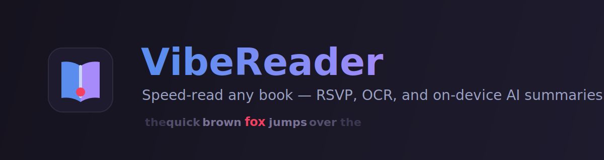

# VibeReader

A desktop **speed-reading app** for your own EPUB and PDF books. Open a book, then read it word-by-word with **RSVP** (Rapid Serial Visual Presentation) at whatever pace you can handle — with OCR for scanned PDFs and optional on-device AI chapter summaries.

Everything runs locally. Your books never leave your machine.

## Features

- 📖 **EPUB & PDF loading** — streaming loaders with abort support for large files
- ⚡ **RSVP reader** — word-at-a-time presentation with a fixed optimal-recognition-point so your eyes never move
- 🎚️ **Pacing engine** — adjustable WPM, ramp-up, regression, skim mode, and a training mode
- 🔍 **OCR** — reads scanned/image-only PDFs via Tesseract (bundled, offline)
- 🧠 **AI chapter summaries** — concise, spoiler-free summaries generated **on-device** with Apple Intelligence (macOS only)
- 🔖 **Resume, bookmarks & thumbnails** — picks up where you left off, with a page thumbnail strip
- 📊 **Session stats** — track what you've read and how fast

## Requirements

- **Node.js** 20+
- **macOS** for the AI summary feature — it uses Apple's on-device `FoundationModels` (Apple Intelligence must be enabled in System Settings). The rest of the app is cross-platform.
- **Swift toolchain** (Xcode CLT) only if you want to build the `SummaryHelper` binary that powers AI summaries.

## Getting started

```bash
npm install

# Run the web app in the browser (Vite dev server)
npm run dev

# Run as the Electron desktop app
npm start
```

### Building

```bash
npm run build         # type-check + bundle the renderer
npm run build:swift   # build the macOS SummaryHelper (Apple Intelligence)
npm run dist          # full Electron build (runs build:swift + build + electron-builder)
```

### Tests

```bash
npm test
```

## How it was built

This project was **100% vibe-coded with [Claude](https://claude.com/claude-code)** — every line was generated through a conversation with Claude, driven primarily by the **`/plan`** and **`/grill-me`** workflows (plan-first, then relentless interrogation of the plan before writing code). No code was hand-written by a human; the author directed, reviewed, and decided.

## License

[MIT](LICENSE) © 2026 Corbin Johnson.

You can use, modify, and ship this freely — commercial use included. If you build on VibeReader, a shout-out to **corbinq27** is appreciated but not required. 🙏

### Credits

VibeReader bundles and depends on excellent open-source projects — see [`NOTICE`](NOTICE) for full attribution. Notably:

- [Tesseract.js](https://github.com/naptha/tesseract.js) (Apache-2.0) — OCR
- [pdf.js](https://github.com/mozilla/pdf.js) (Apache-2.0) — PDF rendering
- [epub.js](https://github.com/futurepress/epub.js) (BSD-2-Clause) — EPUB parsing
- [React](https://react.dev) (MIT) and [lucide](https://lucide.dev) (ISC) icons

The VibeReader logo and banner are original artwork released under the same MIT license.
